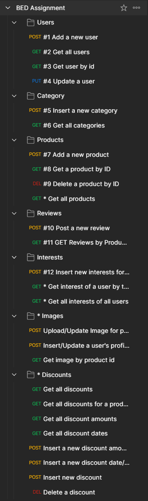

<h1>BED Assignment - CA1</h1>
<p>Nabil Ridhwanshah - DIT/FT/1A/05</p>

# Endpoints
_Note that endpoints or folders with an asterisk (*) means that they are optional and created by me for either the ease of development or advanced features_



# Instructions
1. Import Database Data from the `DB_DUMP` folder under the schema name `sp_it`.
2. Run `npm install` on the root directory of this project to install the dependencies of the project.
3. Create a `.env` with the following properties (for the sake of presentation and testing, these environment variables are already provided).
```env
HOST=<Your Host>
PORT=<Your Port>
CLOUDINARY_API_KEY=<Your Cloudinary API Key>
CLOUDINARY_API_SECRET=<Your Cloudinary Secret Key>
CLOUDINARY_CLOUD_NAME=<Your Cloudinary Cloud Name>
```
4. Run `node index.js` on the root folder of this project.
5. Voila! Your app is running!

## Advanced Features
_Note that **images or pictures** here refer to either a jpg (or jpeg) and png files. All of them are limited to only 1MB_

- Endpoint for inserting images (maximum of 5 images) for a product.
- Endpoint for changing a user's profile picture
- Rate limiting per IP (100 requests/15 mins)
- Cloudinary implementation for uploading of images to a content delivery network (for both users and products)

## Things to look for in the future
- Authentication for either admins or the user to change their own profile picture or update product images.

## What I have learnt
- Cloudinary implementation (thanks to the kind kickstart by Mr Tan)
- Promises (used in the product images endpoint)
- SQL and MySQL
- Processing files buffers via streams